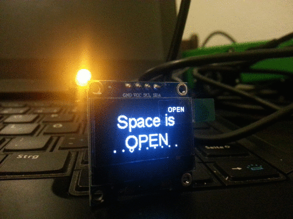

# EBK-Statuswatcher

# Configuration
config wlan ssid and password.
save that config.h.example as config.h

# Serial output
\##### connecting to 

......

WiFi connected

IP address: 

x.x.x.x

\##### connecting to eigenbaukombinat.de

certificate matches

\#####  requesting URL: /status/status.json

\#####  request sent

\#####  header /status/status.json

HTTP/1.1 200 OK

Date: Wed, 14 Feb 2018 18:25:50 GMT

Server: nginx/1.6.2

Content-Type: application/json

Content-Length: 587

Last-Modified: Wed, 14 Feb 2018 18:25:47 GMT

ETag: "5a847f2b-24b"

Accept-Ranges: bytes

Connection: close

headers received

\>> Space open

closing connection 

\##### connecting to eigenbaukombinat.de

certificate matches

\#####  requesting URL: /unsere-Veranstaltungen/

\#####  request sent

\#####   header /unsere-Veranstaltungen/

HTTP/1.1 200 OK

Date: Wed, 14 Feb 2018 18:25:51 GMT

Server: Apache/2.2.22 (Debian)

X-Powered-By: PHP/5.4.45-0+deb7u12

Link: <https://eigenbaukombinat.de/wp-json/>; rel="https://api.w.org/"

Link: <https://eigenbaukombinat.de/?p=10108>; rel=shortlink

Vary: Accept-Encoding

Connection: close

Transfer-Encoding: chunked

Content-Type: text/html; charset=UTF-8

headers received

 14. 2. Thema Holzaktiventag

 14. 2. Thema Fototag

closing connection

